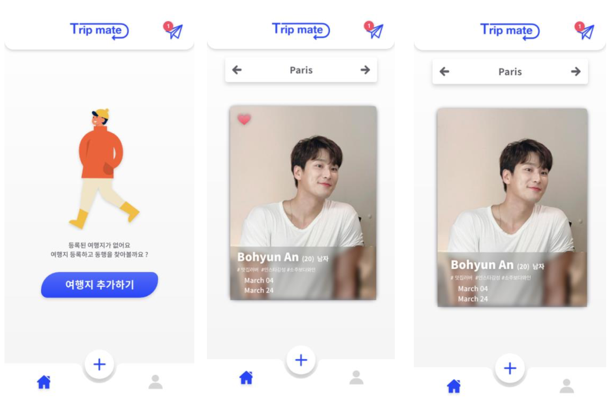
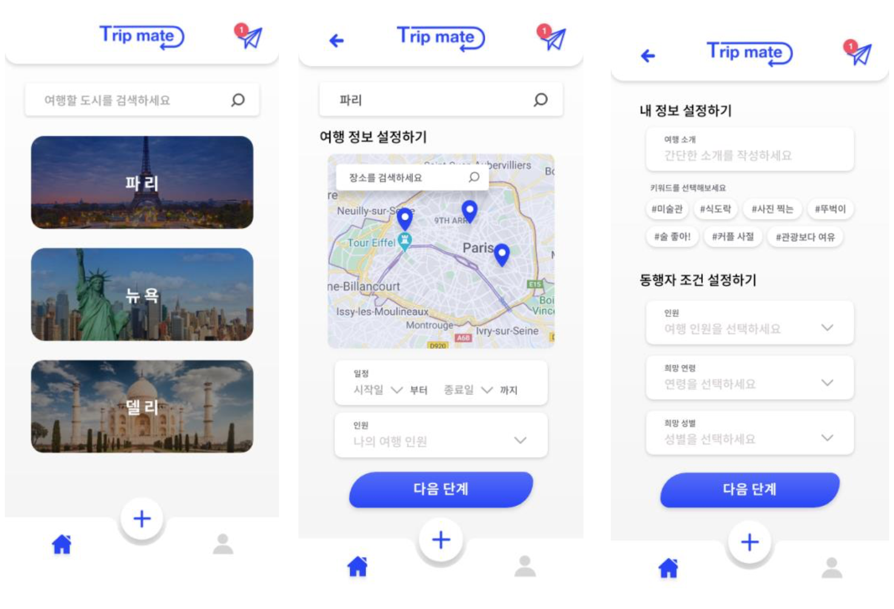
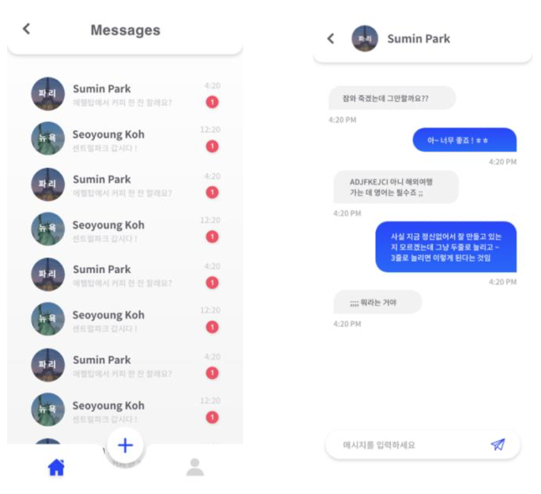
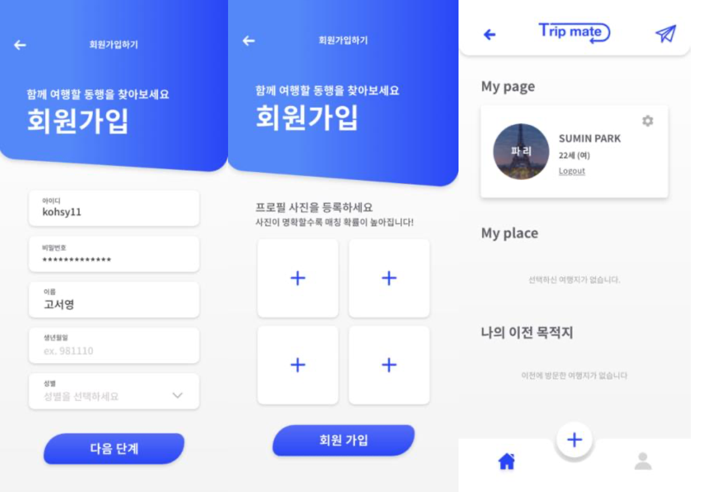

**TripMate(트립메이트)**

*2020.08.15-16 연합 해커톤*

+ heroku 배포 Url: https://hellotripmate.herokuapp.com  

**서비스 소개**     
+ 동행 매칭 서비스 ‘트립메이트’는 여행객들이 자신이 원하는 조건에 부합하는 동행자를 더욱 쉽게 구할 수 있게 하는 플랫폼 서비스이다. 이용자는 자신의 여행과 원하는 동행 조건을 입력한 뒤, 그에 맞는 타 이용자를 추천받게 되며 쌍방으로 동행을 원할 경우, 자동으로 채팅방이 생성되어 실제 동행 할 수 있게 한다.
+ 현재로서 동행을 구하는 가장 널리 알려진 방법은 (특히 유럽 여행의 경우) 네이버 블로그 ‘유랑’의 동행게시판에서 직접 글을 올려 찾는 것이다. 이 방법의 가장 대표적인 문제로서는 자신의 연락처를 노출시켜야 한다는 점이 있다. 특히, 일부 회원들이 불건전한 목적의 연락을 하는 경우가 많다는 점에서 불편함을 느끼는 회원이 많다. 또한, 지역 별 열람이 불가능하기 때문에 게시판의 글이 자신의 일정과 지역에 맞는지 일일이 확인을 해야한다.
  ‘트립메이트’는 이러한 기존의 불편함을 다음과 같은 주요 기능으로 해소하고자 한다.

**주요 기능**
 **1. 매칭기능**     
매칭 기능은 ‘트립메이트’의 핵심 기능으로, 이용자간의 동행 매칭을 가능케한다.

+ 여행이없는경우: 이용자가등록한여행내역이없는경우,여행의추가를돕는‘여행추가하기’버튼이메인 페이지에 뜬다. 해당 버튼, 혹은 하단 nav 바의 +버튼을 누르면 여행을 등록하는 페이지로 연결된다. 이용자가 여행지를 등록하였다면, 메인 페이지에는 동행 후보의 프로필 카드가 나타난다.

+ 여행지 선택: 메인 페이지 상단의 좌, 우 버튼을 통해 내가 등록한 다양한 여행지 카테고리로 이동할 수 있으며, 각 페이지에서는 여행 별 동행 후보를 볼 수 있다.

+ 프로필 카드: 상대방의 프로필과 여행을 요약한 내용을 담고 있는 카드이다. 본인의 사진, 나이, 인원, 성별, 간단한 여행 컨셉, 여행 일자 등을 보여준다. 나와 일정과 여행지가 겹치는 이용자의 프로필카드만 보여주어, 동행을 쉽게 찾을 수 있다. 카드를 좌우로 스와이프하여 호감을 표시할 수 있다. 오른쪽으로넘겨상대방에게호감을표할수있고,왼쪽으로넘겨카드를지울수있다. 이용자간쌍방으로 호감을 표하게 되는 즉시 채팅방이 생성되며 바로 채팅이 가능하다.

​			
 
**2. 여행생성**       
하단 nav 바의 + 버튼을 통해 여행을 생성할 수 있다.       
+ 장소 등록: 내가 원하는 여행지를 검색하여 선택한 후, 내가 꼭 방문하고자 하는 장소를 지도에서 선택할 수 있다. 선택한 장소는 나를 동행으로 고려하는 상대방도 열람할 수 있으며, 마이페이지에서 수정 가능하다.

+ 희망 동행인 조건 등록 : 동행인으로 희망하는 상대의 연령대나 성별, 인원수를 고를 수 있다. 선택된 사항들은 이후 메인 페이지의 프로필카드에 반영이 되어 자신이 원하는 조건을 가진 사람들만 보이게 된다.

​			
 
**3. 채팅**         
+ 채팅리스트: 매칭이 성사된 채팅방의 목록을 시간 순 정렬로 보여준다. 여행 지역명, 채팅 상대방의 닉네임, 읽지 않은 메세지 숫자 그리고 시간을 보여준다.

+ 채팅방: 여행지명과 채팅 상대방의 이름이 상단에 표기되며, 보내는 채팅은 오른쪽에 받는 채팅은 왼쪽에 정렬된다. 뒤로 가기 버튼을 누르면 채팅 리스트 페이지로 돌아간다.											
			 
**4. 회원가입 및 마이페이지**      
+ 회원가입: 유저의 기본 정보를 등록한다. 프로필 사진 등록의 경우, Nudity Detection API 를 이용하여 선정적이거나 얼굴이 아닌 사진 등, 부적절한 파일을 등록할 수 없도록 구현했다.

+ 마이페이지**:**동행을구할때노출되는본인의프로필,여행정보,동행자조건등을수정할수있다. 또한, 기간이 지난 여행지를 열람할 수 있는 ‘나의 이전 여행지’ 기능을 통해 추억을 회상할 수 있다.

​				

